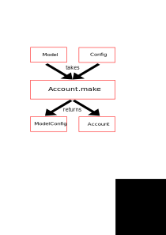

# Introduction

When people are talking about reflex, you will often hear a phrase like:

```
Reflex is not really complex or hard, but it can be hard to figure out how to
properly structure your application. Patterns and best practices, still need to
be developed and documented.
```

Well that's certainly true. I started
with [reflex](https://github.com/reflex-frp/reflex)
and [reflex-dom](https://github.com/reflex-frp/reflex-dom) in December 2017,
with a rewrite of [Gonimo](https://gonimo.com), which was formerly written
in [PureScript](http://www.purescript.org/)
with [purescript-pux](https://github.com/alexmingoia/purescript-pux). I was
under deadline pressure, and new to reflex so I coded it down in a rush, in about
4 - 5 months. The resulting code has basically no architecture at all and is
neither really modular, nor maintainable nor easily extensible and also rather
error-prone to work with.

Lately, I took some time, inspired by some discussions I had
on
[Haskell Exchange 2017](https://skillsmatter.com/conferences/8522-haskell-exchange-2017) with
awesome people like [Christian Takle](https://github.com/christiantakle), to
design a proper architecture for [Gonimo](https://github.com/gonimo/gonimo)
and [reflex](https://github.com/reflex-frp/reflex) based applications in
general. Most of Gonimo is still not ported to this new architecture, but the
parts I ported, look already pretty promising, so I am going to write about it.

# Intended Audience

People who are familiar with FRP
and [reflex](https://github.com/reflex-frp/reflex) in particular and are
wondering how they can structure their applications better.

Spoiler alert, this is how a top level reflex wiring can look like:

```haskell
app :: forall t m. AppConstraint t m => Config -> m ()
app conf' = build $ \ ~(modelConf, model) -> do
  liftIO $ putStrLn "Loaded - yeah!"

  conf                     <- toModelConfig conf'

  __environment            <- Environment.make

  __server                 <- Server.make model modelConf

  (authConf, __auth)       <- Auth.make model

  (accountConf, __account) <- Account.make model modelConf

  subscriberConf           <- Subscriber.make model modelConf

  __settings               <- Settings.make modelConf

  uiConf                   <- makeUI model

  pure ( mconcat [ conf
                 , authConf
                 , accountConf
                 , subscriberConf
                 , uiConf
                 ]
       , Model {..}
       )
  where
    build :: ((ModelConfig t, Model t) -> m (ModelConfig t, Model t)) -> m ()
build = void . mfix
```

Note that the above code has the UI properly separated and is fully modular. The
Wiring is partly automated, and the compiler will warn you, if you missed a
wiring. (Unused reference warning)

# Goals of this Architecture

The architecture should:

1. make an application modular
2. enable proper separation of logic from UI
3. make an application robust against coding errors
4. make an application maintainable and easily extensible
5. be fun, actually the most important part and of course related to points 1 to 4.

Let's dive in.

# The Component
In order to provide modularity, the Gonimo Architecture builds upon the notion
of a component. A component is some piece of software, providing some
functionality with a given public interface and some (optional) dependencies on other
components. This is pretty abstract, let's get to the code.

The currently pretty
simple [Account](https://github.com/gonimo/gonimo/blob/5afd58dfd6e21525c0688508d978429b51bc85f7/front/src/Gonimo/Client/Account.hs) 
component of Gonimo, will do as the running example.

## Component Building Blocks

`Account` currently only has a single purpose, it offers a `Dynamic` containing invitations currently claimed by the client.

```haskell
data Account t
  = Account { -- | Invitations currently claimed by the account. (At the moment,
              --   just the ones claimed in this session.)
              _claimedInvitations :: Dynamic t ClaimedInvitations
            }

type ClaimedInvitations = Map InvitationSecret InvitationInfo
```

Gonimo is a baby monitor, which needs devices to be coupled for operation.
Coupling is implemented by sending out invitations, which are then claimed by
the receiving device before responding to it. Once an invitation is claimed, no
other device will be able to claim the invitation.  - Just to provide a bit of
context.



### The Model

The first part of a component, I want to get started with, is probably the most
important one: The model. As suggested by the title, we build a classical
"Model - View - Controller" architecture, with the model playing the essential
role. What the model is, in the Gonimo architecture, is actually dependent on
whom you ask. Every component has its own view on the model. The component's
model is basically the components the component depends on. This is important
and is the key element to understand: It makes the architecture modular and
actually work.

The model gets passed in, into a component's [make function][Account.make], providing it
with its dependencies.

For `Account` the [model][Account.Model] is simply the [Server][Server.Server],
providing it with the means to react to messages, coming from the server:

```haskell
type Model t = Server t
```

The above given model, actually just serves as an example satisfying
our [HasModel][Account.HasModel] constraint. It is useful for testing the
component in isolation, but other than that we resort to a polymorphic type
satisfying `HasModel`:

```haskell
-- | Our dependencies
type HasModel model = Server.HasServer model
```

for the point of illustrating the model of a component with more requirements,
here you can see the model's definition for [Subscriber][Subscriber.Model]:

```haskell
data Model t
  = Model { __server :: Server t
          , __auth   :: Auth t
          }


-- | Constraint on needed dependencies.
type HasModel model = (Server.HasServer model, Auth.HasAuth model)
```

It does not only depend on the `Server`, but also on [Auth][Auth.Auth], which
provides an event that signals successful authentication.

### The Config

The second part, that also gets passed in to the [make function][Account.make], in addition to the model, is the [component's Config][Account.Config] or rather some type satisfying [Account.HasConfig][Account.HasConfig]. 

The `Config` is a component specific configuration data type, usually consisting
of some events, triggering the component to do some work. In our example
the [Account.Config][Account.Config] looks like this:

```haskell
data Config t
  = Config { -- | Claim an invitation by providing it's secret.
             _onClaimInvitation :: Event t [InvitationSecret]
             -- | Answer an invitation. (Decline/accept it.)
           , _onAnswerInvitation :: Event t [(InvitationSecret, InvitationReply)]
           } deriving (Generic)
```

So Account can be told to claim an invitation and to respond to an invitation.
This is part of the public facing API of `Account`: Dependent components can ask
`Account` to claim an invitation by providing a config type that
fulfills [Account.HasConfig][Account.HasConfig].

As every component may provide a `Config` type and a `HasConfig` type class, it
should have become clear that in this architecture, modules are expected to be
imported qualified.

### The ModelConfig

So a component takes optionally a `Model` and a `Config`, the [ModelConfig][Account.ModelConfig] is one of two optional return values of the component's [make][Account.make] function:

```haskell
-- | Example datatype fulfilling 'HasModelConfig'.
data ModelConfig t
  = ModelConfig { -- | For subscribing important commands.
                  --
                  --   We subscribe important commands to ensure they will be
                  --   delivered even on connection problems.
                  _subscriberConfig :: Subscriber.Config t

                  -- | Commands going to the server.
                , _serverConfig     :: Server.Config t
                }

-- | Configurations we provide for the model as inputs.

type HasModelConfig c t = (IsConfig c t, Subscriber.HasConfig c, Server.HasConfig c)
```

The `ModelConfig` consists of `HasConfig` satisfying values for components,
`Account` depends on. In our case it depends on
some [Subscriber.HasConfig][Subscriber.HasConfig]
and [Server.HasConfig][Server.HasConfig].

Which means that our `Account` will be able to send messages to the server and
will be able to tell `Subscriber` to subscribe to changes on the server.

For other components, that in turn depend on `Account`, they will require
`Account.HasConfig` on their `ModelConfig`, in our case this is
currently [UI code][AcceptInvitation.UI.HasModelConfig].

So to recap, 'Config' is your components configuration, `ModelConfig` is the
configuration you provide for your dependencies. You take a config, you provide
a `ModelConfig`.

### The Component Type itself

In addition to a `ModelConfig` triggering actions in other components, a
component will usually provide some information/functionality which then, in turn
will serve as part of the model of other components. This data is usually named
like the component, in our case
[Account][Account.Account]:

```haskell
-- | Account data.
--   All data belonging to the current active account should go here. Like
--   claimed invitations or user name, ...
data Account t
  = Account { -- | Invitations currently claimed by the account. (At the moment,
              --   just the ones claimed in this session.)
              _claimedInvitations :: Dynamic t ClaimedInvitations
            }

type ClaimedInvitations = Map InvitationSecret InvitationInfo

```

So our account provides a dynamic Map consisting of claimed invitations, that
need to be responded to. Components needing this information, will simply have
a [HasModel][AcceptInvitation.UI.HasModel] definition that includes
`Account.HasAccount`.

`Account` is the second part of the public facing API of our component. So other
components can ask our component to perform actions (`Account.Config`) and can
retrieve data provided by the component (`Account.Account`).

### The make function

Every component needs to be set up. This is what
the [make function][Account.make] is there for. For `Account` it looks like
this:

```haskell
make :: ( Reflex t, MonadHold t m, MonadFix m, MonadJSM m
        , HasModel model, HasConfig c, HasModelConfig mConf t
        )
     => model t -> c t -> m (mConf t, Account t)
make model conf = do
  _claimedInvitations <- makeClaimedInvitations model
  let
    serverConfig' = answerInvitations conf

  subscriberConfig' <- subscribeInvitationClaims conf

  pure $ ( serverConfig' <> subscriberConfig'
         , Account {..}
         )
```

As you can see, it takes a model which needs to satisfy `HasModel`, the
configuration (satisfying `HasConfig`) and returns a `mConf` (satisfying
`HasModelConfig`) for sending events to components it depends on and the `Account`
itself. `Account` is the only thing that is left monomorphic. By keeping all
these parameters polymorphic we get really neat decoupling of components and, as
we shall see, ease of usage.

By specializing to `Model`, `Config` and `ModelConfig` we can test the component
with the minimum amount of required dependencies (which can all easily be
mocked), while at the same time making it easy to use in a production setting,
as we shall see.


## Module Structure

I usually split up a component in at least two modules, one containing the
public facing API, which specifies the interface of the component as seen by
other components, building upon its services. This module is called like the
component, in the case of `Account`, this would be, well, `Account`. This is the
module, users of the component will import. The other module, which re-exports
the API module also includes the implementation, the specification of needed
dependencies (Model) and the `make` function for actually building the component. This
module needs to be imported, for setting up the component. This will usually be in
a single place.

This split-up is obviously not required, but makes it easy to swap out the implementation.

Illustrated with our `Account` example, we have:

- [Gonimo.Client.Account][Gonimo.Client.Account]: The Interface: `Config` and `Account` data types
  and accompanying type classes, `HasConfig` and `HasAccount`.
- [Gonimo.Client.Account.Impl][Gonimo.Client.Account.Impl]: The implementation: `Model`, `ModelConfig`
  accompanying constraints, `HasModel` and `HasModelConfig` and of course the
  actually implementing code and the component's `make` function.

## Note about Lenses

As you've seen above, we use classes for specifying the interface of a component (`HasAccount`, `HasConfig`, ...), these classes are based on lenses. You can have them generated by means of TemplateHaskell, by using [makeLensesWith][makeLensesWith]:

```haskell

$(makeLensesWith (classyRules & generateLazyPatterns .~ True) ''Account)
```

Make sure to set `generateLazyPatterns`, as strict patterns don't play well
with [mfix][mfix], which is used directly or indirectly by reflex based
applications.

For Gonimo we have to pass on TemplateHaskell, because TemplateHaskell does not
play well with cross compilation, which we need for our
native [Android version][Gonimo Android]. This is why I wrote
a [simple lens generator][lens generator] program which takes data definitions
on stdin and outputs the lens definitions. Call it with `classy` as argument in
order to get the classy version:

```
dev-GenerateLenses classy
```

I use it by copying the data definitions to the bottom of the file, then select
the definitions and have my editor pass it through `dev-GenerateLenses classy`.
This is obviously not the most elegant way, also the tool is written pretty
dirty, but it works for me - so if you need something similar, feel free to get
inspired ;-)


# Conclusion and Monoids

The most important part is probably that we split up a component's input into a
model (its dependencies on other components) and a `Config` which is
introduced by the component itself. This leads to a clean and easy to use
architecture. In part 2 of this series we will put this all together and we will
see how to actually build a full blown application out of components, reaching
the goals we aimed for.

If you like this architecture and want to give it a try, but don't have a toy
project at hand - feel free to play with Gonimo! Most of the frontend is still
legacy code, with no architecture at all, if you want to give a hand, porting it
to the Gonimo Architecture - pull requests would be greatly appreciated! For
questions and discussions, please join our [gitter chat][gonimo gitter]!

Stay tuned for part 2, Monoids rock! ;-)


[Gonimo.Client.Account]: https://github.com/gonimo/gonimo/blob/239ffb031ece20dccdb806ad7476f0da8c3018eb/front/src/Gonimo/Client/Account.hs
[Gonimo.Client.Account.Impl]: https://github.com/gonimo/gonimo/blob/239ffb031ece20dccdb806ad7476f0da8c3018eb/front/src/Gonimo/Client/Account/Impl.hs
[Account.Config]: https://github.com/gonimo/gonimo/blob/239ffb031ece20dccdb806ad7476f0da8c3018eb/front/src/Gonimo/Client/Account.hs#L19
[Account.Account]: https://github.com/gonimo/gonimo/blob/239ffb031ece20dccdb806ad7476f0da8c3018eb/front/src/Gonimo/Client/Account.hs#L33
[Account.HasConfig]: https://github.com/gonimo/gonimo/blob/239ffb031ece20dccdb806ad7476f0da8c3018eb/front/src/Gonimo/Client/Account.hs#L64
[Account.ModelConfig]: https://github.com/gonimo/gonimo/blob/239ffb031ece20dccdb806ad7476f0da8c3018eb/front/src/Gonimo/Client/Account/Impl.hs#L51
[Account.Model]: https://github.com/gonimo/gonimo/blob/239ffb031ece20dccdb806ad7476f0da8c3018eb/front/src/Gonimo/Client/Account/Impl.hs#L45
[Account.make]: https://github.com/gonimo/gonimo/blob/239ffb031ece20dccdb806ad7476f0da8c3018eb/front/src/Gonimo/Client/Account/Impl.hs#L72
[Account.HasModel]: https://github.com/gonimo/gonimo/blob/239ffb031ece20dccdb806ad7476f0da8c3018eb/front/src/Gonimo/Client/Account/Impl.hs#L48
[Server.Server]: https://github.com/gonimo/gonimo/blob/239ffb031ece20dccdb806ad7476f0da8c3018eb/front/src/Gonimo/Client/Server.hs#L33
[Server.HasConfig]: https://github.com/gonimo/gonimo/blob/239ffb031ece20dccdb806ad7476f0da8c3018eb/front/src/Gonimo/Client/Server.hs#L130
[Subscriber.Model]: https://github.com/gonimo/gonimo/blob/239ffb031ece20dccdb806ad7476f0da8c3018eb/front/src/Gonimo/Client/Subscriber/Impl.hs#L32
[Subscriber.Config]: https://github.com/gonimo/gonimo/blob/239ffb031ece20dccdb806ad7476f0da8c3018eb/front/src/Gonimo/Client/Subscriber.hs#L20
[Subscriber.HasConfig]: https://github.com/gonimo/gonimo/blob/239ffb031ece20dccdb806ad7476f0da8c3018eb/front/src/Gonimo/Client/Subscriber.hs#L37
[Auth.Auth]: https://github.com/gonimo/gonimo/blob/239ffb031ece20dccdb806ad7476f0da8c3018eb/front/src/Gonimo/Client/Auth.hs#L15
[AcceptInvitation.UI.HasModelConfig]: https://github.com/gonimo/gonimo/blob/239ffb031ece20dccdb806ad7476f0da8c3018eb/front/src/Gonimo/Client/AcceptInvitation/UI.hs#L30
[AcceptInvitation.UI.HasModel]: https://github.com/gonimo/gonimo/blob/239ffb031ece20dccdb806ad7476f0da8c3018eb/front/src/Gonimo/Client/AcceptInvitation/UI.hs#L32
[makeLensesWith]:  https://hackage.haskell.org/package/lens-4.16.1/docs/Control-Lens-TH.html#v:makeLensesWith
[mfix]: https://www.stackage.org/haddock/lts-11.2/base-4.10.1.0/Control-Monad-Fix.html#v:mfix
[Gonimo Android]: https://play.google.com/store/apps/details?id=com.gonimo.baby
[lens generator]: https://github.com/eskimor/dev-utils/blob/master/app/GenerateLenses.hs
[gonimo gitter]: https://gitter.im/gonimo/Lobby

